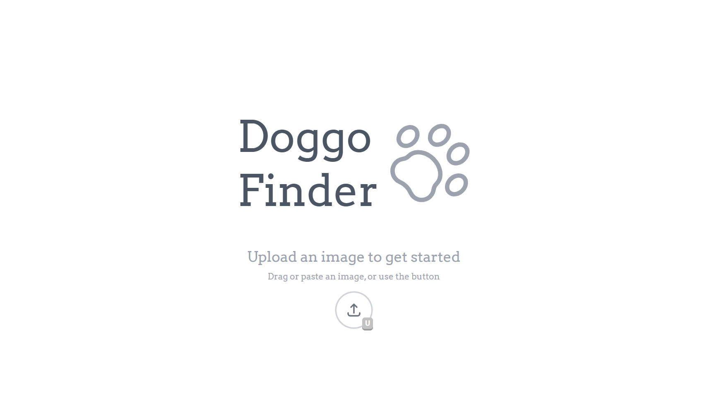
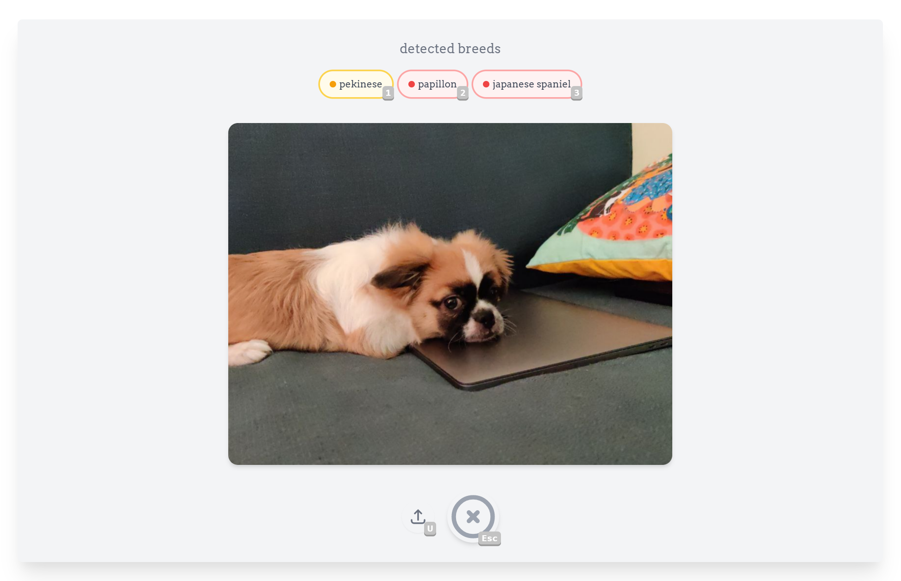
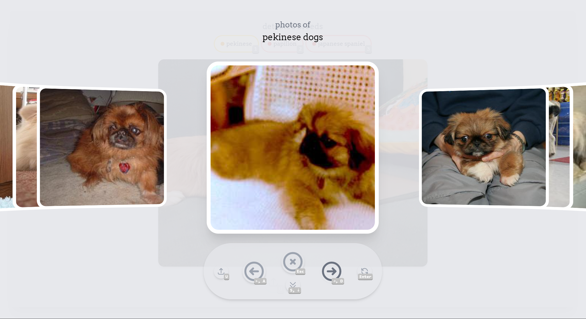
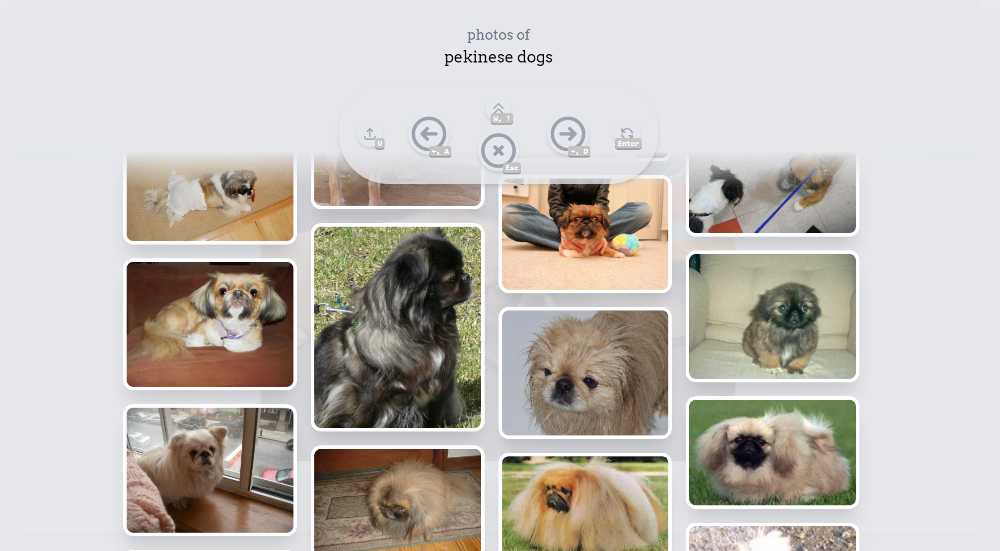

# Doggo Finder

A dog breed detector powered by [Tensorflow.js](https://github.com/tensorflow/tfjs-models/tree/master/mobilenet) and [dog.ceo/api](https://dog.ceo/dog-api/), with a strong focus on keyboard accessibility.

## Features

- Upload images to identify if it has a dog, and its breed
- Supports pasting images from the clipboard
- Multiple gallery modes, horizontal and vertical

## Development

```bash
yarn install
yarn dev

# built with
#  node 14.16.1 (LTS)
#  next.js 10.2
#  tailwindcss 2.1
```

Interested in the technical details and decisions? See [TECHNICAL.md](TECHNICAL.md).

## Screenshots

**Note:**
The hotkeys hide on Mobile UI.





### Coming Next:

**Live Mode**  
Point your device camera at a doggo to identify its breed, real-time! No need to upload an image.

TODO: README
TODO: Host
